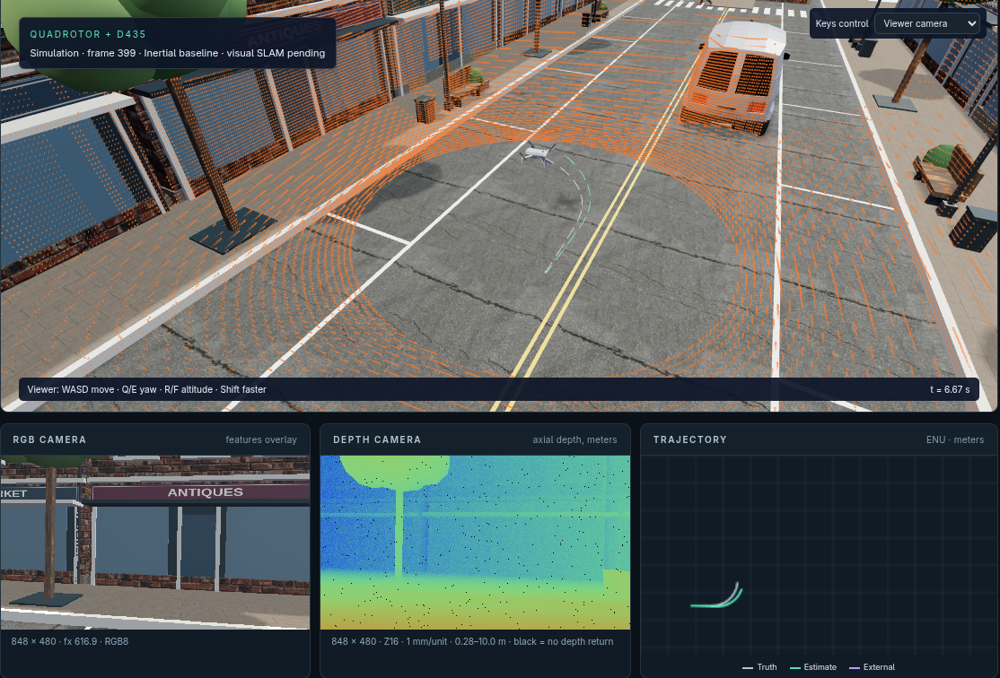

# SLAM Lab

An open source UAV lab that runs in your browser. Explore a simulated city, see
what a drone's sensors see, and edit the math behind its motion—all without
installing a robotics stack.

[**Open the browser demo →**](https://cognipilot.github.io/slam_web/) · [Source on GitHub](https://github.com/CogniPilot/slam_web)

[](https://cognipilot.github.io/slam_web/)

[](https://cognipilot.github.io/slam_web/)

Wait for **Run** to become available, then click it. No setup or initial
**Apply & reset** is needed.

The flight tour and live depth image work in the default inertial demo.
If your browser uses CPU software rendering, a visible warning explains the
automatic lightweight preview. Hardware rendering keeps the native sensor sizes.

## Why use it?

- **Start with a link.** Students and collaborators can open the same lab across
  desktop platforms, without installing Python, containers, or local services.
  Phones get a compact layout and Low graphics by default.
- **See through simulated sensors.** Three.js uses the GPU to render RGB camera
  images, depth images, and an optional 64-beam LiDAR scan. Camera noise and depth
  quantization also run in shaders.
- **Edit the math where it runs.** Change Modelica physics and estimator source
  in the browser, with Rumoca language tools and WebAssembly execution.
- **Understand the whole pipeline.** Inspect the Modelica source for computer
  vision, feature matching, Kalman filtering, mapping, loop closure, and physics
  in one workspace. Students can follow how the pieces fit together and compare
  algorithms as the full SLAM runtime is integrated.
- **Control the experiment.** Adjust sensor rates, lighting, graphics quality,
  cars, and pedestrians. Lockstep timing keeps physics and sensor processing
  synchronized even when an experiment runs slower than real time.
- **Keep your work.** Save projects locally, export them to a file, and reload
  them with their edited source and settings.

## Try it

Start with the city flight tour, or choose **Big city · furnished interiors**
to explore a market, loft, and conference room. Open **Configuration** to change
the scene and sensors; open **Editor** to inspect or edit Modelica source.

Choose a model from **Run model**. The default is `Examples.InertialOnly`;
the responsive and smoothed variants demonstrate the IMU filter tradeoff.
Use **Files** to browse and edit the Modelica library. The viewer and editor
can each collapse or fill the screen without losing your work.

Use **WASD** to move the viewer, **Q/E** to turn, and **R/F** to change altitude.
Hold **Shift** to move faster. On a phone, scroll below the viewer for controls
and the editor. Performance depends on the device and selected settings.

**Current status:** Quadrotor physics, inertial propagation, GPU sensor rendering,
and project persistence run in the browser. Full visual SLAM—including connected
visual corrections, mapping, and loop closure—is still in development. This is a
prototype for teaching and experimentation.

## Performance and portable deployment

Modelica describes the mathematical problem. Rumoca compiles that description
and can optimize the connected math across component boundaries. Our goal is to
let algorithms stay readable while the compiler adapts their execution to the
available hardware. Hardware scheduling can evolve without being baked into
each algorithm's implementation.

We plan to package the pipeline as a downloadable **FMU** using the emerging
[FMI-LS WebAssembly format](https://github.com/modelica/fmi-ls-wasm), so the same
math can run in the browser and on a real machine with a compatible runtime and
hardware interfaces. We also plan to optimize **CPU and GPU execution** for
these FMUs. Complete SLAM FMU export and robot deployment remain roadmap work;
today's demo ships browser WASM assets.

## Develop locally

Maintainers can use the reproducible [Nix environment](flake.nix):

```sh
nix develop --no-update-lock-file path:.#ci
npm ci
npm run assets
npm run dev
```

`npm run build` produces a static site. GitHub Actions deploys it to Pages after
the supported demo's CI checks pass on `main`.

- [Development, tests, and compiler review](docs/development.md)
- [Modelica source guide](models/README.md)
- [Camera and sensor details](docs/camera.md)
- [Editable SLAM workspace](docs/modelica-slam-source-workspace.md)
- [Architecture and current SLAM integration](docs/architecture.md)

## License

Copyright 2026 Cognipilot. Licensed under [Apache 2.0](LICENSE); see [NOTICE](NOTICE).
Third-party models, textures, and dependencies retain their own licenses and
[asset credits](public/models/licenses/ACTORS.md).
