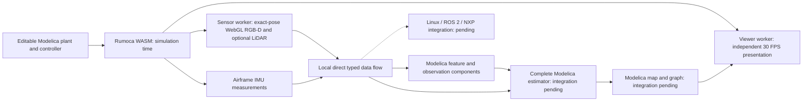

# Runtime architecture and remaining scope

Physics, sensor processing and algorithm mathematics belong in editable Modelica source compiled by Rumoca. Three.js supplies 3D rendering; unavoidable UI/I/O/worker/compiler plumbing remains host glue. Python execution, Rust algorithm nodes, legacy editor presets, companion dependencies and Docker execution are removed from the intended runtime. The complete RGB-D/airframe-IMU SLAM replacement is still being integrated; nominal INS and individually verified kernels must not be presented as complete visual SLAM. See the [migration ledger](../dev/modelica-runtime-migration.md).

The current interface should center on the Modelica editor and simulation
configuration. A visual node editor is deferred. The execution target is one
Modelica processing graph lowered and compiled to WASM by Rumoca through Solve
IR, including compiler-owned storage and scheduling. The application must not
implement a parallel Modelica compiler or generate algorithm WASM. Existing
separate sessions and app-side vision emitters remain migration work; the
diagram below describes data dependencies, not a required visual editor.

## Contracts

- Coordinates are ENU world, FLU body and Hamilton wxyz quaternions. Camera optical coordinates are right/down/forward. Units are SI.
- Ports are typed; required inputs have exactly one publisher and zero-delay cycles are rejected. Host code owns rendering, UI, message routing, buffer lifetime and persistence. Algorithm mathematics and decisions belong in Modelica.
- Independent RGB-D (15/30/60/90 Hz), LiDAR (5/10/20 Hz), IMU (30/60/90/180 Hz) and GPS (1/5/10 Hz) schedules share an exact 180 Hz integer clock grid in `src/sensor-clock.ts`. Physics advances to the next due event and waits for its processing. RGB and depth share each camera timestamp; each camera frame awaits every connected algorithm and local typed output delivery. Wall-time throughput follows the slowest stage; no due sample or frame is dropped. The viewer independently targets 30 wall-time FPS.
- Quality defaults are Low 15/10/90/5 Hz, Medium 30/10/90/5 Hz and High 90/20/90/10 Hz, in RGB-D/LiDAR/IMU/GPS order. Saved custom rates override defaults until explicitly reset to quality defaults.
- Features use RGB pixel coordinates and scores. Calibrated frames and connected feature output supply estimator observations. Ground truth only generates sensors and evaluates results.
- The versioned `SLB1` envelope is defined in `src/packet.ts`; sizes are explicit, depth floats are little-endian and invalid depth is zero.
- Physical mounting supplies both `opticalToBody` and `originFlu`, describing a finite proper optical-RDF → body-FLU transform. Older simulated records retain their documented forward/up mounting contract.
- Physical capture must rectify color, transform factory depth through depth/color extrinsics and retain color-optical Z. Camera and external IMU timestamps map into a measured common domain. Frame validity, sensor identity, bracketing and skew are checked before publication; arrival time never substitutes for measurement time. See [camera contracts](camera.md).
- IMU is canonical Synapse `InertialSampleData` (40 bytes); odometry is `OdometryData` (72 bytes), generated from the pinned Synapse schema. Custom payloads must not masquerade as those messages.
- Modelica artifacts carry source SHA-256, compiler provenance, checked layouts and bounded memory. Native assignment artifacts retain compiler-issued stage/target ownership; hosts may copy inputs and route outputs but may not discover solve order or rewrite mathematics. Unsupported profiles fail explicitly. See [artifact boundaries](modelica-native-artifacts.md).
- The inertial worker uses Rumoca's compiler-owned Solve IR simulation session. Its TypeScript WASM generator and RK4 integrator have been removed. Saved `rumoca-state-node` binaries are discarded while Modelica source is retained. Session metadata records source/compiler identity; it is not a portable compiled program. Automatic execution may retain canonical interpreted Solve IR fallback for unsupported native kernels. Nominal INS still has no full Kalman covariance, visual correction, registration, map or loop closure.
- Projects retain graph, sources, physics, environment, seed and matching artifacts. Legacy Python or retired Rust algorithm execution requires an explicit migration error with recoverable saved source, no execution fallback and no silent relabeling or inertial substitution.
- Evaluation references remain outside algorithm inputs. External streams compare only shared source timestamps after explicit first-pose alignment; estimate-to-estimate RMS is not ground-truth accuracy.
- Recorded truthless data retain sensor timestamps and validity. Physical acquisition may have gaps; simulation retains every lockstep frame. Neither path invents truth.

## Full Modelica acceptance

The complete pipeline must compose preprocessing, feature selection, calibrated observation formation, descriptors, matching and rank-aware registration with 15-state prediction/covariance/correction. Bounded keyframes, landmark lifecycle, tracking loss, relocalization, geometric loop verification, pose-graph optimization and reanchoring must also execute from editable Modelica. Fixed-capacity arrays with counts or masks keep embedded work bounded without reducing the full sensor workload.

Independent tests must retain arbitrary mounting, inverse-depth and discontinuity checks, single-plane degeneracy, covariance cross terms, conditioning, rejection/recovery, pose-graph corrections and false-loop rejection. Source edits must change outputs and survive save/reload. Actual browser room-loop and moving-city gates, complete-step timing and target hardware checks remain necessary. Independent sensor cadences and the requested 10× realtime factor are distinct; the latter remains unmet.

Python removal does not establish this acceptance. Historical estimator/component measurements in [performance](performance.md) and [geometry validation](geometry-validation.md) retain their original workloads and limitations. They must not be carried forward as passing results for the replacement.

## Host rendering and editing

Three.js renders RGB to sRGB and depth to raw linear targets. Separate viewer/sensor OffscreenCanvas workers retain exact sensing poses and timestamps. Dedicated sensor workers reporting hardware acceleration select synchronous readback; software/unknown worker renderers and main-thread fallback retain pooled asynchronous pixel-pack buffers. Both paths wait for complete capture before the next physics timestamp and retain exact RGB/depth/LiDAR parity. Scene-matrix reuse bounds rendering work, and failed captures must clean up submitted work before reuse. Headless software rendering establishes correctness, not hardware GPU speed.

Lighting, photographic materials and deterministic cars/people belong to the rendered scene. Their controls and simulation-time animations must remain identical in viewer and sensor scenes; evaluation overlays never enter camera targets. Optional cube-view LiDAR retains FLU radial samples and its documented resolution limit. [Actor](../public/models/licenses/ACTORS.md) and [texture](../public/textures/pbr/ATTRIBUTION.txt) credits remain intact.

Main Street has an 11.4 m road, 3 m sidewalks and 7.4 × 10 m storefront footprints. Modelica owns actor trajectories: city cars travel straight in opposing lanes and recycle at x = ±33 m before the training enclosure at x = 36 m; pedestrians follow sidewalks and cross at x = −29.8/32 m. Saved actor sources without the scene-route interface retain their authored geometry. The host copies configuration and returned poses without calculating trajectories.

Keyboard controls default to an independent viewer camera. WASD translates, Q/E changes yaw, R/F changes altitude and Shift increases movement speed in wall time, even while the simulation is paused. **Drone commands** is an explicit alternate mode requiring a running simulation and Flight tour off. Viewer movement never changes truth or sensing poses.

LiDAR capture now publishes `samples: Float32Array` with shape `[64, columns, 4]`
and format `FLU_XYZ_PACK24`. XYZ is local FLU; the fourth channel retains the
exact 24-bit radial code. All four channels are zero for an invalid return.
Range in metres is `code / 16777214 * far`; beam `b` elevation is
`(15 - 40*b/63)` degrees. GPU shaders compute coordinates and clear invalid
returns. The sensor worker transfers that buffer without per-sample host
decoding, filtering or compaction. Rendering binds the same interleaved buffer
and discards invalid points in its shader. The viewer receives an owned copy
at its 30 Hz presentation deadline. The unused prototype binary encoder now
uses explicit `SLR2` framing and copies those raw bytes; it does not produce
the earlier `SLR1` radial-only packet.

This is acquisition and presentation, not LiDAR odometry. Compiled Modelica
node consumption of the raw scan remains pending. CPU work still present in
the camera path includes packed-depth decoding, RGB row transport and depth
noise; feature selection still ranks and suppresses candidates on the host.

Each LiDAR scan is an instantaneous snapshot at its own scheduled physics timestamp; rotating beam times and motion distortion are not modeled. The 5 Hz simulator option is experimental. Ouster documents [10/20 Hz OS1 operating modes](https://docs.ouster.com/sensor-docs/firmware/sensor-performance); its [OS1 product page](https://ouster.com/products/hardware/os1) lists a 20 Hz maximum. Sensor-worker rendering uses the committed pose for each due sensor, whether or not a camera frame is due at the same time.

Rumoca supplies the browser Modelica language server. Editor diagnostics and completion do not imply executable-profile support. Source compilation, cold preparation, hot evaluation and whole-graph throughput require separate evidence. Current checked ODE WGSL support does not establish a general stateless image-compute GPU backend.

## Filter and registration requirements

The retained estimator convention uses world-additive position/velocity errors, right-local attitude errors and body accelerometer/gyro biases. Full covariance propagation needs checked process-noise integration, Joseph updates and attitude injection reset, following [Solà's error-state derivation](https://arxiv.org/pdf/1711.02508). Map-frame correction must transport position, velocity, gravity and covariance while retaining body biases and explicit uncertainty. Loop closure is not an independent bias observation.

RGB-D registration uses frozen reference geometry and uncertainty, including relative-pose lever arms and local attitude basis. A verified single planar overlap must retain unobservable tangent translation and rotation about the plane normal. Noisy normals must not manufacture independent constraints. Continuous calibrated rays and inverse axial depth determine lifted landmarks; invalid measurements and depth boundaries are rejected.

Shared-observation and relative-pose correlations require documented approximations. Mapping needs consistent geometry, recent accepted corrections and bounded uncertainty. Prediction continues during loss while unreliable poses stop adding points. Covariance displays are visualization only. Physical alignment, noise/timing calibration, motion excitation and robust relocalization remain separate requirements.

## External integration

Browser graph nodes exchange local typed data directly, without Zenoh or a transport service. The retired companion, camera and ROS executables are unavailable. Replacement Modelica Linux deployment, ROS 2 message transport, calibrated hardware capture and NXP/RDD2 interoperability remain pending. Earlier QEMU/DDS tests demonstrate historical packaging/message contracts, not complete replacement-estimator operation. [Deployment](deployment.md) and [ROS 2](ros2.md) preserve that evidence and the required boundaries.

Multiple UAV namespaces, GPS/SLAM transitions, mission authoring, flight-controller/ground-station adapters, rigid-body contact coupling and physical flight validation remain larger project work. No published site or hardware-ready full SLAM claim follows from the runtime removal.
